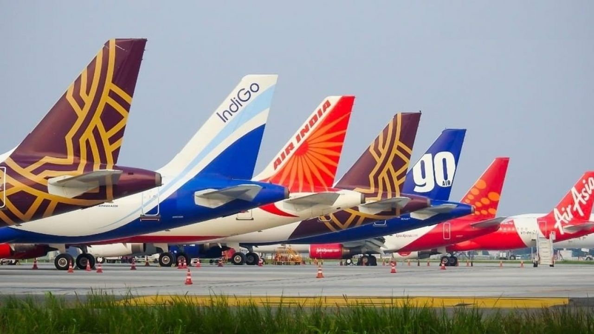

# Flight Pricing Analysis (Indian Airline Carriers 2022)

Understanding the Primary Drivers of Airline Ticket Prices

---

**Overview** Analyizes 300,000+ flight records in order to determin the primary drivers of airline ticket prices.

---

## Key Takeaways

---

## What I Did

---

## Interactive Dashboard

---

## Technologies Used

* Python: pandas, 
* Notebook: jupyter
* Visualization: matplotlib, seaborn, tableau public
* Data set: https://www.kaggle.com/datasets/shubhambathwal/flight-price-prediction
---

## Repo Structure

ticketPricingAnalysis/
- dashboard_data
- data
    - business.csv
    - clean_data.csv
    - economy.csv
- notebooks/
    - analysis.ipynb
- visuals/
    - planes.jpeg
- README.md
- requirements.txt

---

## How to Run

pip install -r requirements.txt
jupyter notebook notebooks/analysis.ipynb

---

## Why It Matters

---

## Next Steps

